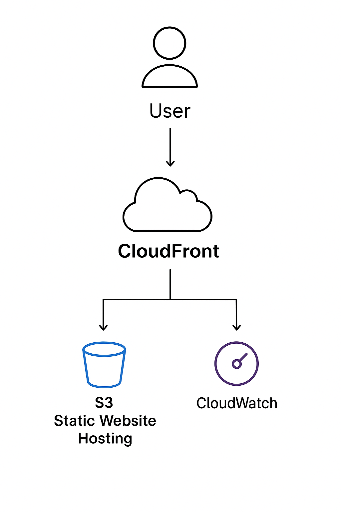
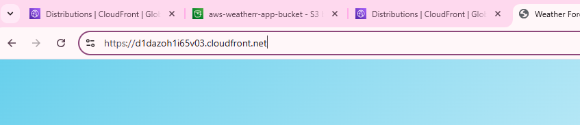
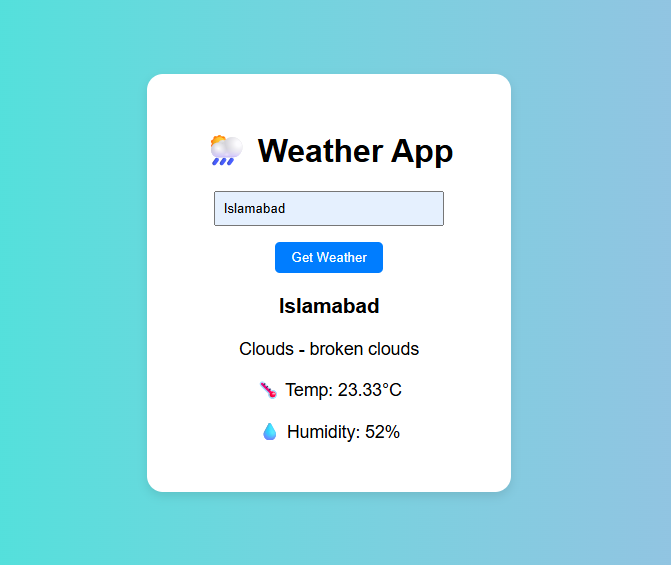

# 🌦️ AWS Weather App – S3 + CloudFront + GitHub Actions

A simple static weather web app deployed using **Amazon S3** (for hosting), **CloudFront** (for CDN & HTTPS), and **GitHub Actions** (for CI/CD).

---

## 🧩 Architecture Overview

Below is the simplified architecture of this project:



---

## 🚀 Live Demo

**CloudFront URL:** [https://d1dazoh1i65v03.cloudfront.net](https://d1dazoh1i65v03.cloudfront.net)




---

## 🧱 Tech Stack

- **Frontend:** HTML, CSS, JavaScript
- **Cloud:** AWS S3 + CloudFront
- **CI/CD:** GitHub Actions
- **Containerization:** Docker (for local testing)

---

## ⚙️ Run Locally

```bash
# Clone the repository
git clone https://github.com/<your-username>/aws-weather-app.git
cd aws-weather-app

# Run locally (optional)
python3 -m http.server 8080
```

Then open [http://localhost:8080](http://localhost:8080)

---

## 🐳 Docker Run

```bash
docker build -t weather-app .
docker run -p 8080:80 weather-app
```

Visit [http://localhost:8080](http://localhost:8080)

---

## ☁️ AWS Deployment Steps

### 1. Create S3 Bucket
- Bucket name: `aws-weatherr-app-bucket`
- Region: `us-west-2`
- Enable **Static Website Hosting**
- Upload website files

### 2. Create CloudFront Distribution
- Origin: S3 Website Endpoint
- Enable HTTPS
- Copy CloudFront domain for public access

### 3. Setup CI/CD via GitHub Actions
- Add the following **repository secrets** in GitHub:
  - `AWS_ACCESS_KEY_ID`
  - `AWS_SECRET_ACCESS_KEY`

GitHub Actions automatically deploys to S3 and invalidates CloudFront cache whenever you push to `main`.

---

## 🔐 Security Notes

- No credentials are hardcoded.
- All AWS credentials are securely stored as GitHub secrets.
- Safe to share CloudFront URL publicly.

---

## 🧾 License

This project is created for **educational and cloud deployment demonstration purposes**.
